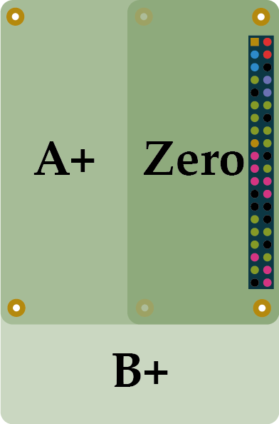

## Raspberry Pi

The RPi is an awesome, tiny, powerful computer. Coming from the 2012s, the RPi was released to help students in even elementary schools be able to learn programming and embedded systems in a fast or fun way!

Check out [links](#links) at the end to find some awesome resources for the Raspberry Pi.

So, without further ado, let's get started!

## Introduction

There are currently 7 models of RPi's. You can find the official list at [raspberrypi.org/products](https://www.raspberrypi.org/products/). Here's a simple list though:

 - RPi 4B - the newest and coolest Raspberry Pi, boasting up to 8GB of RAM!
 - RPi 3A+ - Raspberry Pi Foundation's third generation computer, in A+ format*
 - RPi 3B+ - Third generation, fastest and most furious, RPi model.
 - RPi 3B - again gen 3, B model*
 - RPi 2B - the second generation of Raspberry Pi's, B edition*
 - RPi 1B+ - the first, original Raspberry Pi, best edition
 - RPi 1A+ - the cheaper first generation model of the RPi 1B+
 - RPi Zero W - the smaller, cooler, RPi - starting at 15 bucks, get the smallest RPi around!**
 - RPi Zero - the Zero W but for 5 bucks, and without the wireless support

\* See [differences](#differences).

** Furthermore impressive because it features built-in WiFi and Bluetooth, all in that tiny package.

### Differences
 
Each generation of RPi's has tons of imporvements, speed-wise and sometimes size-wise. Pricing follows a business model, but these are really powerful computers!
 
But, how about the part that says "A", "B", "A+", etc? Well, the RPi A variants are just the more modest versions of their counterparts - or shall I say, the B variants are the more expensive ones ;). The `+`'s are self-explanatory -- the RPi 3B+ is slightly cooler than the 3B.

And finally, the Zero is the tiny version of the Pi's - the best for things like embedded devices!

## So, you've got a Pi? 

Let's get familiar. 

### The GPIO

GPIO, you might have heard that before when shopping for an RPi - GPIO stands for "General-Purpose Input/Output". A mouthful. Pretty much, the GPIO allow you to control the Input and Output of whatever you plug into it. Imagine them as wires, just in the form of pins, through which electricity can be conducted (and controlled. with programming!). That's your GPIO!

Here's a diagram for the RPi 4's GPIO. That's the one for the rich kids so that's the one we'll be using throughout - but if you have another model, just search up "<model name> GPIO" and go to images - there'll be a million.

Now, this may/may not look like an onslaught of information to you. Let's break it down to the most important ones:

 - GPIO (then a number) - this is a GPIO pin, that can be used for anything. There are a lot of GPIO pins, which is why there's a numbering scheme.
 - 3V3 Power - this provides 3V power to any wire you attach to it.
 - 5V Power - this provides 5V power to any wire you attach to it.
 - Ground - this is the ground, well-known in electrical engineering. Super useful as a last emergency - if something goes wrong, you can route exess power to ground so that your RPi doesn't get fried.
 
 Note: you can ignore the text in brackets `()` for now.
 
 
